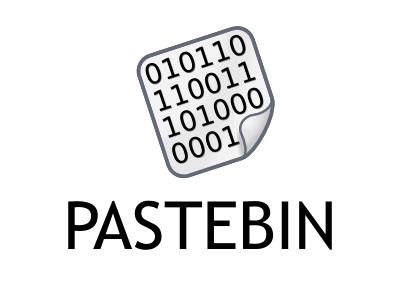

# Pastebin-Automation
<strong>A Python script that takes your clipboard and in return gives you a pastebin link with the clipboard text</strong>
# Installation and Usage
```bash
git clone
cd Pastebin-Automation
pip install -r requirements.txt
python main.py
```
